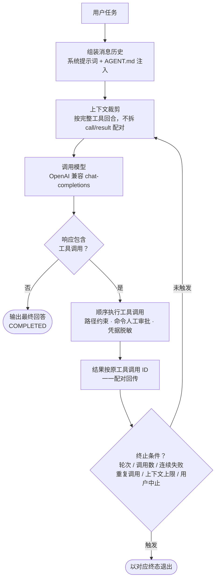
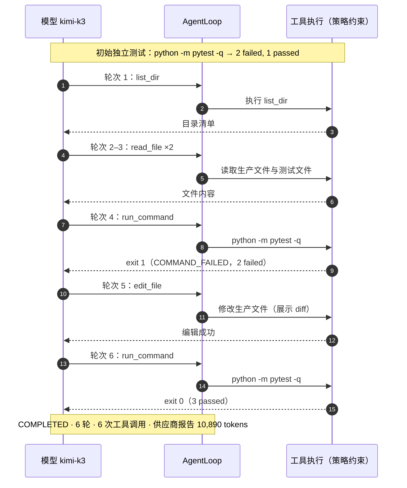

<div align="center">
  
  <h1>code-operator</h1>
</div>

code-operator 是一个从零实现的命令行编程智能体（coding agent）：通过模型原生 tool calling，在受约束的本地工作区内自主读写文件、执行命令，并根据真实执行结果继续推理，直至完成编程任务。

项目**不使用任何 agent 框架或 Agent SDK**。模型客户端、agent 循环、工具执行、上下文管理、会话与安全策略均独立实现。未完成或未验证的能力不视为已经实现。

## 特性一览

| 类别 | 能力 |
|------|------|
| 核心闭环 | 原生 tool calling、工具调用 ID 严格配对、多重终止条件（轮次/调用数/连续失败/重复调用/上下文上限） |
| 本地工具 | `list_dir`、`read_file`、`grep`、`write_file`、`edit_file`、`run_command` 六件套 |
| 上下文管理 | 窗口估算、为输出预留空间、按完整工具回合裁剪历史，不拆 call/result 配对 |
| 会话能力 | 交互式 REPL、`/undo` 文件撤销、`/compact` 历史压缩、`/init` + AGENT.md 项目记忆闭环 |
| 安全边界 | 工作区路径约束、敏感文件拒绝、命令人工审批、超时与进程树终止、凭据脱敏、审计日志 |
| 可验证性 | 真实任务与黄金 eval 的脱敏证据入库、870+ 离线测试、测试进程拒绝真实网络 |

## 快速开始

要求 Python 3.11。

```bash
python -m pip install -r requirements.txt
```

运行时只从环境变量读取三个必要配置（API Key 不得写入仓库、README 或演示视频）：

```bash
CODE_OPERATOR_API_KEY=<YOUR_API_KEY>
CODE_OPERATOR_BASE_URL=https://api.moonshot.cn/v1
CODE_OPERATOR_MODEL=kimi-k3
```

**一次性模式**：执行一个任务后退出，适合脚本与 CI。`COMPLETED` 返回 0，`USER_ABORTED` 返回 130，其他运行终态返回 1，参数或配置错误返回 2。

```bash
python -m code_operator --workspace <WORKSPACE> "<TASK>"
```

**交互模式**：省略位置任务，在同一进程内连续输入任务；配置延迟到首个普通任务才加载，单个任务失败后仍可继续输入。可用 `--max-model-rounds N` 等参数调整上限。

```bash
python -m code_operator --workspace <WORKSPACE>
code-operator> 检查项目并修复失败测试
code-operator> /status
code-operator> /exit
```

## 本地命令

交互模式只识别整行且不带参数的本地命令；未知命令或带参数形式在本地拒绝，自然语言中的同名片段不会触发命令。

| 命令 | 作用 |
|------|------|
| `/help` | 列出本地命令（一次性模式也可用，不加载配置） |
| `/status` | 报告 workspace、模型、AGENT.md 加载状态、撤销深度、待注入事件与本会话累计 token；会话未初始化时不加载配置 |
| `/init` | 提交预设任务：分析工作区并生成/更新 `AGENT.md`（调用模型） |
| `/compact` | 将当前对话历史交给模型压缩为摘要并替换历史；失败时保持原历史不变，成功后重置文件读取状态（调用模型） |
| `/undo` | 后进先出撤销最近一次成功且确实改变文件的直接 `write_file`/`edit_file` |
| `/new` | 清空对话、读取状态和撤销记录，但不恢复文件 |
| `/exit` | 退出；存在撤销记录时要求确认 |

**AGENT.md 项目记忆闭环**：会话启动时若工作区根目录存在 `AGENT.md`，其内容（有界截断、标注为参考数据）会自动附加到系统提示词，与 `/init` 形成"生成 → 注入"的闭环；`/status` 中 `agent_md` 字段显示加载状态。

**`/undo` 细节**：最多保留 32 条记录及 8 MiB 旧 UTF-8 内容快照；新建文件会删除，既有文件原子恢复。撤销前重新检查当前路径仍为工作区内普通 UTF-8 文件并核对修改后哈希；文件被外部修改、替换或变为链接/目录时拒绝覆盖且保留记录。不撤销 `run_command` 及其外部副作用。成功撤销会在下一次普通输入中注入一次有界本地事件，提醒模型重新读取文件。会话历史与撤销记录仅存在于当前进程，不提供跨进程 Resume 或 checkpoint。

## 架构

### 核心执行循环

Agent 的闭环由「模型响应 → 工具执行 → 结果回传 → 继续推理」构成，工具调用按 ID 严格配对，多重终止条件保证循环有界：



### 模块清单

```
__main__.py   CLI：参数解析、交互循环、本地命令分发、审批交互
session.py    AgentSession：组装工具/客户端/审计/撤销/AGENT.md 注入
loop.py       AgentLoop：模型轮次、工具调用配对、终止条件、/compact
client.py     ModelClient：httpx 调用 OpenAI 兼容 chat-completions
context.py    ContextManager：token 估算与按完整工具回合裁剪
policy.py     WorkspacePolicy（路径安全）+ CommandPolicy（命令审批）
journal.py    ChangeJournal：文件变更快照与撤销
redaction.py  Redactor：凭据脱敏
audit.py      JsonlAudit：脱敏结构化审计
trace.py      终端安全的执行轨迹输出
tools/        六个工具的注册与本地实现
```

## 安全边界

已实现工作区真实路径限制、敏感文件拒绝、符号链接/目录联接逃逸检查、文件读取状态与哈希覆盖保护、命令审批、`shell=False`、固定工作目录、超时、输出上限、当前 Windows 场景的进程树终止和统一凭据脱敏。命令默认显示参数数组和固定工作目录并要求人工批准；只有显式启用 `--auto-approve-tests` 时，未被工作区同名文件遮蔽的裸命令 `pytest` 或 `python -m pytest` 才自动放行。

同一模型轮次包含多个工具调用而发生中止时：已完成的调用保留真实结果，当前调用返回 `USER_ABORTED`，尚未开始的调用返回 `NOT_EXECUTED_AFTER_ABORT`；所有结果按原工具 ID 和顺序一一配对后停止本次请求链。

这些措施是应用层防护，**不构成操作系统沙箱**；用户批准的代码仍可能访问网络或工作区外资源。

## 终端执行轨迹

CLI 以纯文本输出模型轮次、工具名、脱敏后的有界参数摘要、工具结果、审批 ASK 及 ALLOW/DENY 决策、文件 diff、命令退出码和受限长度的 stdout/stderr。仅当 stdout 为交互式终端时，对 CLI 自身生成的标记行（模型轮次、工具结果、审批决策、diff 增删行、终态）附加 ANSI 颜色；颜色在文本完成脱敏与控制字符消毒之后包裹整行，重定向、管道或设置 `NO_COLOR` 时保持纯文本。展示文本先脱敏，再把终端控制字符转成可见转义，避免 ANSI、OSC、回车、退格或双向格式字符伪造顶层事件和审批标记；过长内容保留头尾并插入 `original_chars` 标记。读取/搜索类工具不回显结果 payload。trace 与独立的脱敏 JSONL audit 相互独立，程序不主动持久化 trace；终端历史、重定向或录屏仍可能保存输出，diff/stdout/stderr 公开前仍需人工检查。

## 验证与证据

- **离线测试**：Windows/Python 3.11 上 870+ 项测试覆盖循环、会话、撤销、上下文、中止配对、CLI 与安全行为；脚本化假模型逐轮核对回放字段与工具 ID 配对；测试进程拒绝未模拟的真实 socket 连接。
- **真实任务验收**（2026-08-28，kimi-k3）：隔离 buggy Python 项目，初始独立测试 2 失败 1 通过，agent 只修改生产文件，最终独立复跑 3 通过；6 轮、6 次工具调用，供应商报告 10,890 tokens；审计中未出现当前 API Key 或 Bearer。证据：[`docs/evidence/m4-real-task.json`](docs/evidence/m4-real-task.json)。
- **黄金 Eval**（2026-08-29，kimi-k3）：冻结订单价格流水线任务经 `python -m evals.run_golden --report <NEW_REPORT.json>` 在三个全新临时工作区运行，三次全部成功；测试文件哈希未变，变更路径仅为生产文件。证据：[`docs/evidence/e2-golden-eval.json`](docs/evidence/e2-golden-eval.json)（另保留修复评测器环境净化问题前的报告以供审查）。
- **双系统横评**：与 Kimi Code 的对比记录见 [`docs/agent-comparison-results.md`](docs/agent-comparison-results.md)（五个合成任务、单次运行、独立隐藏测试评分，仅代表该样本）。横评定位出的主要缺陷（草稿脚本残留）已当日修复并对失败单元复跑验证，形成"发现 → 修复 → 验证"的闭环，全过程证据冻结入库。

### 真实任务执行轨迹

下图按 [`docs/evidence/m4-real-task.json`](docs/evidence/m4-real-task.json) 记录的 6 轮 6 次工具调用绘制（每轮一次调用，轮次 2、3 均为 `read_file`，图中合并展示）：



以上结果均只描述对应样本，不泛化为整体成功率。本地 token 估算是粗估，不是供应商 tokenizer 上界。

## 人工审核

每个提交都必须先展示完整暂存差异、验证证据、风险和敏感信息扫描结果，并经明确批准。公开审核规则见 [`REVIEWING.md`](REVIEWING.md)，逐次审核结论见 [`REVIEW_LOG.md`](REVIEW_LOG.md)。审核通过与允许远端推送是两个独立门禁。

## 已知限制与未验证事项

- 应用层防护不构成 OS 沙箱
- 会话与撤销不跨进程持久化；无 Resume、checkpoint 或 `/history`
- Ubuntu CI、真实窄终端的中文显示宽度与编码行为未验证
- 无流式输出、TUI 或运行时切换模型

## 相关文档

设计与已验证边界见 [`DESIGN.md`](DESIGN.md)，设计决策辩护见 [`DEFENSE.md`](DEFENSE.md)，参考资料见 [`REFERENCES.md`](REFERENCES.md)。
